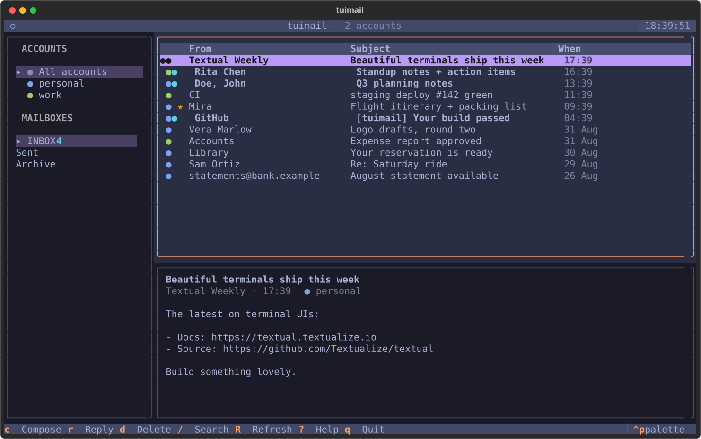

# tuimail

Mail, comfortably, in your terminal. A keyboard-first email client built on
[Textual](https://textual.textualize.io) — IMAP for reading, SMTP for sending,
Python stdlib for everything mail.



## Features

- **Multiple accounts** — add, edit, and remove accounts (each with its own
  provider settings and credentials); every account gets a **color**, shown as
  a dot next to its mail everywhere.
- **All-in-one mode** — the default view merges every account's mailbox into
  one list (sorted by date, colored dots tell them apart); switch to a single
  account from the sidebar or the `Ctrl+P` palette.
- **Account always visible** — the reader shows which account received the
  message, and compose has a colored From-account picker.
- **Onboarding wizard** — provider presets (Gmail, Outlook, Yandex, iCloud,
  custom) fill the servers in; app-password hints per provider.
- **Login / logout** (`Ctrl+L`), optional remember-password (explicit opt-in,
  stored plain in the config file and labelled as such).
- **Three-pane mailbox** — accounts and folders with unread counts, message
  list with unread ● and star ★ markers, live preview pane.
- **Full keyboard control** — vim-style `j/k/g/G`, `?` shows the complete
  reference, `Ctrl+P` opens a command palette (jump to any folder, compose,
  refresh, logout, switch theme).
- **Search** (`/`) — server-side IMAP full-text when possible, local fallback.
- **Link opener** (`o` in the reader) — every URL in the message in a list,
  Enter opens it in your browser.
- **Attachment saving** (`a`) — straight to `~/Downloads`, collision-safe.
- **Reply** with quoted body and proper `In-Reply-To`/`References` threading.
- Background refresh every 60 s; failed sends keep your draft open.
- **Auto-update** — new releases are announced in-app (checked every 15 min);
  `Ctrl+U` downloads, verifies, swaps the binary, and restarts.
- **Demo mailbox** — try the whole UI without an account.

## Install

**macOS** — one line, no sudo, no Gatekeeper prompts (terminal downloads
aren't quarantined). Verifies the release's sha256, installs to
`~/.local/bin`, and puts `tuimail` on your PATH:

```bash
curl -fsSL https://raw.githubusercontent.com/alpatovdanila/tui-mail/main/install.sh | sh
```

**Windows** — same idea, into `%LOCALAPPDATA%\Programs\tuimail`:

```powershell
irm https://raw.githubusercontent.com/alpatovdanila/tui-mail/main/install.ps1 | iex
```

**Any OS with Python** (also creates the `tuimail` command):

```bash
pipx install git+https://github.com/alpatovdanila/tui-mail.git
```

After installing, run `tuimail` — first run shows the onboarding wizard, and
the app updates itself from then on (a toast announces new versions; `Ctrl+U`
installs). Settings live in `~/.tuimail.json`; passwords are stored only if
you tick "remember password".

Manual downloads: every
[release](https://github.com/alpatovdanila/tui-mail/releases/latest) carries
the bare binaries with sha256 digests (a browser download on macOS is
quarantined — clear it with `xattr -d com.apple.quarantine tuimail-macos-universal`).
A new `vX.Y.Z` release is cut automatically whenever the version in
`pyproject.toml` bumps, with notes from [CHANGELOG.md](CHANGELOG.md); a
rolling `latest` prerelease tracks every push.

## Portable builds

The binary is self-contained; run it from a writable directory (USB stick)
and it keeps `tuimail.json` next to itself — portable mode, which never
stores passwords. `tuimail --check` boots the app headless once and prints
`ok`. Build your own with PyInstaller (each OS builds its own binary; on
Windows the `--add-data` separator is `;` instead of `:`):

```bash
pyinstaller --onefile --console --name tuimail --collect-all textual --add-data "tuimail/app.tcss:tuimail" run.py
```

## Keys

| Where   | Key | Action |
|---------|-----|--------|
| Mailbox | `j` `k` `↑` `↓` / `g` `G` | move / first / last |
| Mailbox | `Enter` | read message |
| Mailbox | `c` / `r` | compose / reply |
| Mailbox | `u` / `s` / `d` | unread / star / delete |
| Mailbox | `/` then `Esc` | search, clear |
| Mailbox | `R` | refresh |
| Reader  | `j` `k` `Space` | scroll / page |
| Reader  | `o` / `a` | open links / save attachments |
| Compose | `Ctrl+S` / `Esc` | send / cancel |
| Anywhere| `Ctrl+P` / `Ctrl+L` / `?` | palette / logout / help |

## Security

Audited adversarially (every finding verified by reproduction, fixed, and
regression-tested in the acceptance suite):

- TLS with **certificate and hostname verification** on IMAP, SMTPS, and
  STARTTLS (Python's stdlib verifies nothing by default).
- All message-derived text (headers, bodies, links, reply prefills) is
  **sanitized against terminal escape injection** before it reaches the screen.
- Passwords are stored only with explicit opt-in, plain text by design,
  owner-only file permissions on POSIX — and **never in portable mode**
  (settings next to the exe on removable/shared media).
- Outgoing mail does not leak your hostname or LAN IP (Message-ID and EHLO).
- The login screen always shows which server each password will be sent to.
- Nothing is sent anywhere except your own configured mail servers — plus one
  anonymous version request to api.github.com every 15 minutes for the update
  check (downloads are sha256-verified against the release digest); set
  `"update_check": false` in the config to turn it off.

Known accepted risks: binaries are unsigned (macOS Gatekeeper warns once);
GitHub Actions are pinned by major version, not commit SHA.

## Development

```bash
python tests/acceptance.py        # full acceptance suite (headless, demo backend)
python scripts/screenshots.py     # regenerate docs/*.svg
```

Releasing: bump `version` in [pyproject.toml](pyproject.toml), add a matching
section to [CHANGELOG.md](CHANGELOG.md), push to `main` — CI builds, tags
`vX.Y.Z`, and publishes the release with those notes.

More screens: [onboarding](docs/onboarding.svg) · [login](docs/login.svg) ·
[reader](docs/reader.svg) · [compose](docs/compose.svg) · [help](docs/help.svg)
